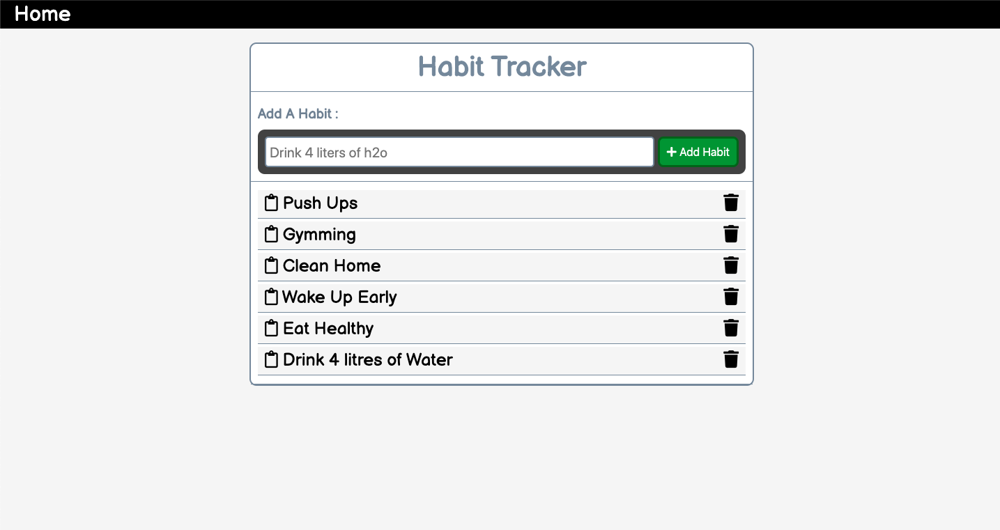
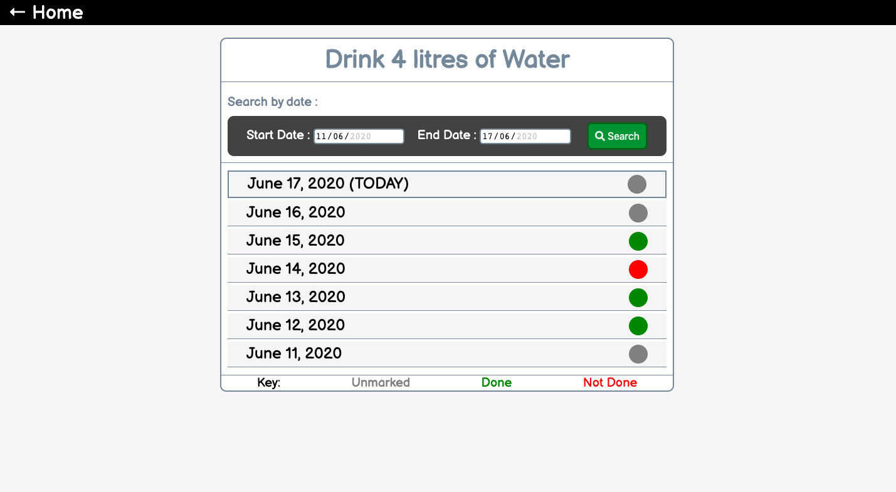

# Habit-Tracker
Do you feel dealing with bad habits is getting on your nerves? Try using this app and it may help you! :)
A basic Habit Tracking System. Tech Stack : HTML, CSS, JS, Node.js

<h2>Home View:</h2>



<h2>Habit View:</h2>



# How-To-Use
1. Clone this project
2. Start by installing npm and mongoDB if you don't have them already.
3. Run the Mongo Server.
4. Navigate to Project Directory by :
```
cd Habit-Tracker
```
5. run following commands :
```
npm install 
```
```
npm start or node index.js
```
# Basic-Features
1. Home page includes all the habits you have added. You can Add or Delete any habit from here.
2. Habits page here you can mark a particular habit for a date marked or not
   here you can also search by dates.
   
# Directory Structure and flow of The Code
This code follows MVC pattern and hence everything is differentiated and well managed:
<p>/routes - containes all the routes.</p>
<p>/assets - static js css and image files.</p>
<p>/controller - contains functions to connect to different views.</p>
<p>/model - to store data in db we need models.</p>
<p>/config - contains config files for mongoos or any other files being used.</p>
<p>/views - used by ejs(templating engine) for server side rendering.</p>

Feel free to use and contribute! :)
